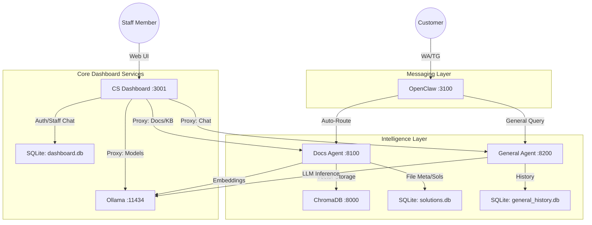

# 🏗️ Full Project Analysis: AI Customer Service Ecosystem

I have conducted a deep scan of the workspace to map out every dependency, data flow, and service interaction. This ensures that our Phase 4 & 5 implementations are architecturally sound.

## 1. System Architecture Map

## 2. Component Audits

### 🟢 Dashboard (Express + React)
*   **State**: Robust. Auth is JWT-based with a Super Admin auto-initialization.
*   **Key Logic**: The `server.js` acts as a heavy-duty proxy. It doesn't just forward requests; it handles Multipart/Form-Data (via Multer) and NDJSON Streaming (via Readable streams).
*   **Database**: Uses `better-sqlite3` for performance.

### 🔵 Docs Agent (FastAPI + ChromaDB)
*   **State**: Fully featured. Support for PDF, DOCX, TXT, XLSX, CSV.
*   **RAG Engine**: Uses `nomic-embed-text` for embeddings and `aya-expanse:8b` (default) for generation.
*   **Watcher**: Includes a Python `watchdog` to automatically ingest files dropped into the `/uploads` folder.

### 🟣 OpenClaw (Node.js Bridge)
*   **State**: Operational but "Black Box" to the dashboard currently.
*   **Routing**: Has a clever keyword-based router (`DOC_KEYWORDS`) to decide whether to send a user to the Docs Agent or General Agent.
*   **WhatsApp**: Uses Puppeteer-based `whatsapp-web.js`. Can be unstable if Chromium dependencies aren't perfect in the container.

## 3. Critical Observations & "Gotchas"

1.  **Model Dependency**: The entire system relies on `aya-expanse`. If this model isn't pulled in Ollama, the Agents will throw 500 errors. *Fix: Our LLM Manager (Phase 2) handles this.*
2.  **Shared Env Vars**: `AGENT_API_KEY` must be identical across `server.js`, `openclaw`, and both Agents, or communication will fail.
3.  **Docker Networking**: In production, services communicate via container names (e.g., `http://ollama:11434`). Locally, we currently default to `localhost`. We need to ensure the dashboard's `.env` handles this switch gracefully.
4.  **No Unified Logs**: Each service logs to its own console. *Action: Phase 5 (Monitoring) will address this by tailing logs via the dashboard.*

## 4. Path to "Master Status"

We are at **60% completion**. The core "Brain" is built. We are now building the "Eyes and Ears" (OpenClaw) and the "Nervous System" (Monitoring).

---

**Does this analysis align with your vision for the project, or are there hidden components/requirements I should look into?**
